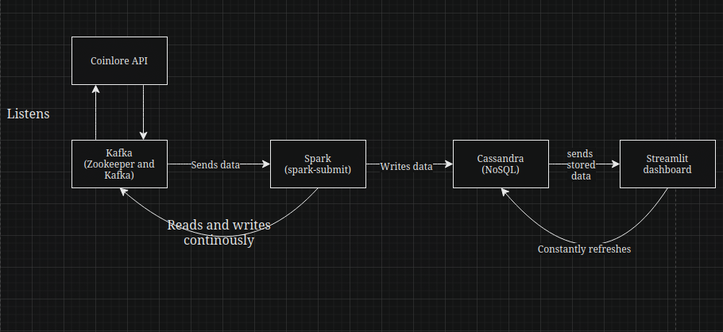
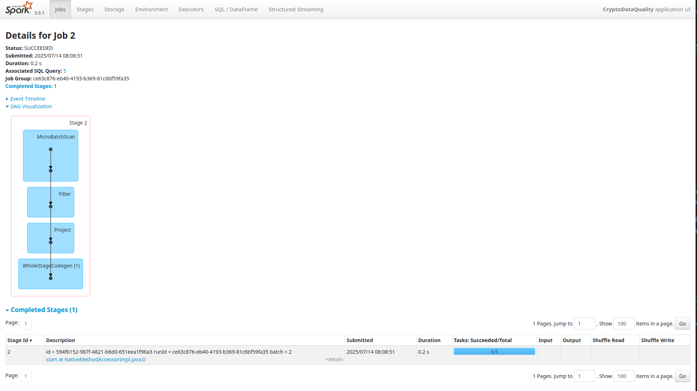

This is end to end streaming project.

My initial thinking is that, i will create a vagrant VM and do the project on a whole there and then dockerize it. then take the image and put in the ec2 instance for checking.

## Small Demo

[Demo Video](project/images/video.webm)

## Prerequisites

Things i need to install and setup before developing in the project : 
- Spark (Version : 3.5.1)
- Kafka (Version : 3.6.1)
- Cassandra (Version : 4.1.3)
- JDK 8
- Vagrant 

## Initial Steps 

Create a folder and go inside the file and do `vagrant init`, this creates a vagrantfile inside it.

```
Vagrant.configure("2") do |config|
	config.vm.box = "ubuntu/jammy64"
	config.vm.synced_folder "./project", "/home/vagrant/project"

	config.vm.provider "virtualbox" do |vb|
		vb.memory = 4096
		vb.cpus = 2
	end

	# Spark default web UI port
	config.vm.network "forwarded_port", guest: 8080, host: 8080

	# Cassandra default port
	config.vm.network "forwarded_port", guest: 9042, host: 9042

	# Kafka default port
	config.vm.network "forwarded_port", guest: 9092, host: 9092

	# Optional: SSH access
	config.vm.network "forwarded_port", guest: 22, host: 2222, id: "ssh"

end
```

The above vagrant file jammy/64 is good one and as the things we going to would require some processing we have allocated 2 cores and 4gb memory. I wanted some port forwarding to my system so it can i check the logs. i have added also a synced_folder for me to develop through vs-code.

After saving the file, do `vagrant up`. This will get the vm up and running. after the vm is up, connect through terminal through ssh. which we can do through `vagrant ssh`.

Before starting other stuff, update the vm. enter this `sudo apt-get update`

Lets setup the main stuff,

Download the jdk 8 : `sudo apt install openjdk-8-jdk -y`'
Check the version for confirming : `java -version`
Save this folder path : `readlink -f $(which java)`

For the 3 main things, follow these commands : 
- Spark :
	- `wgt https://archive.apache.org/dist/spark/spark-3.5.1/spark-3.5.1-bin-hadoop3.tgz`
	- `tar -zxvf spark-3.5.1-bin-hadoop3.tgz`
- Kafka  : 
	- `wget https://archive.apache.org/dist/kafka/3.6.0/kafka_2.13-3.6.0.tgz
	- `tar -zxvf kafka_2.13-3.6.0.tgz`
- Cassandra : 
	- `wget https://archive.apache.org/dist/cassandra/4.1.3/apache-cassandra-4.1.3-bin.tar.gz`
	- `tar -zxvf apache-cassandra-4.1.3-bin.tar.gz`

For spark, setup : 
- go inside the folder and go inside the conf folder 
- `cp spark-env.sh.template spark-env.sh`
- edit the spark-env.sh file, add `export JAVA_HOME = <path>`
- edit the bashrc file and try running 

For Kafka, setup :
- just check this : `bin/kafka-server-start.sh config/server.properties`
- If the above runs it's ok.
- edit the bashrc file

For Cassandra, setup : 
- Rename the file to cassandra
- edit the bashrc file
- type in terminal `cassandra`, it will run and detach from terminal
- `cqlsh` - this will give you access to go inside the cassandra database.

## Sh files 

I have created two sh files for starting the services and stopping the services. for better accessibility

before using it please `chmod +x <file>`, then `./<file>`  to run.

## Coinlore API

Coin Gecko is an free API, which we can pull for this project. It gives me the data for the crypto i ask. It is non-exchange affiliated cryptocurrency data platform. this is useful because it gives unbiased, centralized crytpo market insights.


## Last step before running the Sh files

Before the running of the sh files it is important that you make sure to create table inside the cassandra : 

- `cqlsh` for accessing the cassandra terminal, make sure the cassandra service is up and running. then do the below.

```
CREATE KEYSPACE IF NOT EXISTS crypto 
WITH replication = {
    'class': 'SimpleStrategy', 
    'replication_factor': 1
};

CREATE TABLE IF NOT EXISTS crypto.prices (
    id TEXT,                   
    name TEXT,                 
    price_usd DOUBLE,          
    ts BIGINT,                 
    processing_time TIMESTAMP, 
    PRIMARY KEY (id, ts)       
) WITH CLUSTERING ORDER BY (ts DESC);
```
## The working of this project

Steps : 
- once you start the .sh file
- The zookeeper, Kafka and cassandra gets on. Waits for 30s to fully get on.
- Then Kafka topic gets created, if does not exist
- then we start running the producer.py file which connects with Kafka and listens for any data coming every 30s
- then spark-submit happens to the spark_streaming file which automatically process data every time producers sends new records 
- then each time it processes writes the data to cassandra.
- from cassandra the data is shown as output in streamlit dashboard.



## Spark job 



The DAG operations : 
- MicroBatchScan : reads data from streaming source 
- Filter : Applies the filter function 
- Project : Selects specific columns in the cassandra 
- WholeStageCodegen : Spark  optimization that combines multiple operators into a single function for better performance.


